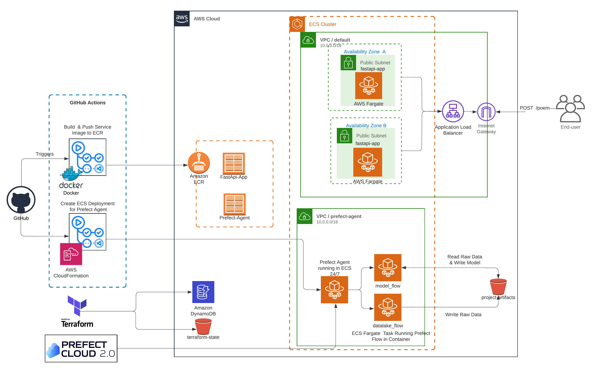

# mlops-capstone-project (poem-generator)

Capstone project for Data Talks MLOps Zoomcamp with aim of practicing automated mlops workflows that works with minimal effort locally and in cloud. The project includes two main capability:

- Fully automated workflow orchestration (with Prefect) for data retrieval and model training tasks.
- Webs service layer for serving machine learning model with Fast API.
  
The final outcome of the project is simplest poem generator api, which returns a ai-created-poem based on the initial prompt given by the end-user.

Addition to the above mentioned two main capabilities, as part of the project, the cloud deployments are automated by the help of different tools sets for infrastrucre as code (terraform, cloudformation, aws cdk) and CI/CD (GitHub Actions).





---
## Where to Start
---

### Required Accounts & Access Keys  

Hereby, required accounts and respective keys will be listed. 
- AWS Console Account and required secrets `AWS_ACCESS_KEY_ID` and `AWS_SECRET_ACCESS_KEY`. Instructions for [retrieving access_key and access_key_id](./infrastructure/README.md)
- Kaggle Account and required secrets `KAGGLE_USERNAME` and `KAGGLE_KEY`. Instructions for [finding the **Kaggle** username and key](https://www.kaggle.com/general/51898) 
- Prefect Cloud Accont and required secrets `PREFECT_API_URL` and  `PREFECT_API_KEY` .Instructions for [creating Cloud Prefect account](https://app.prefect.cloud/) and [finding **Prefect** api_url and api_key](https://docs.prefect.io/ui/cloud-getting-started/)

Caution:: It is highly suggested to collect these parameters in `.env` file and `GitHub Secrets` for each of them as a preparation step.

---
### General Overview 

Infrastructure Creation ([infrastructure](./infrastructure/README.md))
1. Create AWS resources (ECS cluster and fastapi-app service) by following the instructions in `infrastructure` folder.
2. Create AWS resources for prefect-agent via Cloudformation.

Running Data Ingestion and Model Creation flows ([workfflow_orchestration](./workflow_orchestration/README.md))
1. Run the datalake_flow as local flow or a deployment in aws 
   1. The outcome of the flow is stored raw data in artifacts/raw_data folder.
2. Run the model_flow as local flow or a deployment in aws
   1. The outcmode of the flow is stored model file in artifacts/model folder.

Serving the Model as an FastAPI endpoint ([model_serving](./model_serving/README.md))
1. Run the `build-and-ecr-push-model-serving.yml` GitHub workflow for publishing the `fastapi-app` image in ECR.
2. In that state, all of the building blocks of the project is created successfully. Therefore you can go an check the fastapi-app 
   and make a POST request on `/poem` endpoint.


---
## Setting up Development Environment
---
### Python Package Management with Poetry

Poetry is Python Package Management tool that helps managing package dependencies.

1. Install poetry as described in the [Poetry installation](https://python-poetry.org/docs/#installation) section

2. Install packages based on defined versions in either `pyproject.toml` or `poetry.lock`. If you are interested to know details , please check [Installing Dependencies](https://python-poetry.org/docs/basic-usage/#installing-dependencies) section.
    ```bash
    poetry install
    ```

3. Activate the poetry environment
    ```bash
    source {path_to_venv}/bin/activate
    ```

4. To add new packages to the poetry environment. Check the [official documentation](https://python-poetry.org/docs/cli/#add) if you are unsure of usage
    ```bash
    poetry add <package-name><condition><version>
    ```
---
### Pre-Commit Hooks

Pre-Commit allows to run hooks on every commit automatically to point out issues such as missing semicolons, trailing whitespaces, etc.

1. Install pre-commit as described in the [installation](https://pre-commit.com/) section

2. Pre-Commit configuration file is already configured in `.pre-commit-config.yaml`

3. Running Pre-Commit on the repository, can be done in two different approach

    3.1.  Run on each commit, in that case, the hook scripts would not allow you to push your changes in GitHub
    and inform your code success after each commit. For enabling that you need to initiate that once on the repository level as following  
    ```bash
        pre-commit install
     ```

    3.2. Run agains each file, allow you freedom to run hooks when you want, in that case there is no guarantee that each commit fits the coding
    standards that you defined in  precommit configuration. But you can run against all of the files, whenever you want.
    ```bash
        pre-commit run --all-files
    ```

## WIP: Docker-Compose and Creating Dev

1. colima start
2. docker-compose --env-file example.env up --build

-> Up and running prefect_agent, fast_api_app, 

MYSQL_SERVER (running where?)
MLFLOW http://0.0.0.0:5000 (local)

MINIO_OBJECT_STORAGE_SERVER
- Console http://localhost:9001/login
- API http://localhost:9000

BASH_CREATE_BUCKETS

FASTAPI http://0.0.0.0:8000/docs#/ (local)
PREFECT_AGENT (running on prefect server)


Missing Part is that prefect_cli !!! (Due to profile definition…)
3. docker-compose --env-file example.env run prefect_cli
By this you can bash into the flows